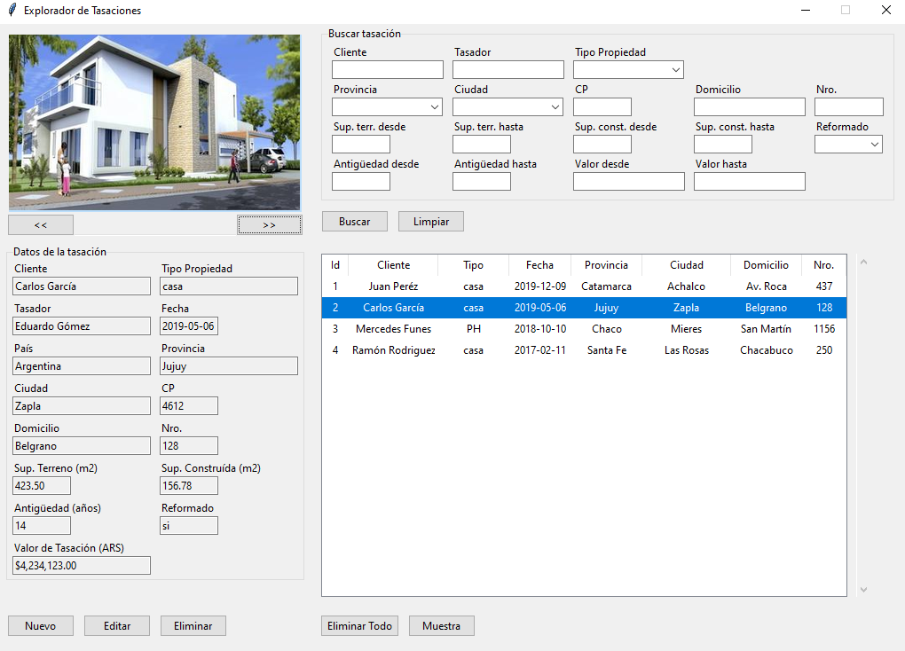
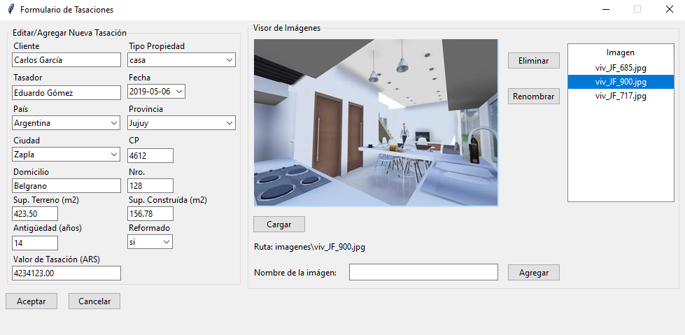

# Explorador de tasaciones inmobiliarias

El proyecto comprende la creación de un programa sencillo en Python que permite guardar y editar información de tasaciones de propiedades en una base de datos e imágenes de las mismas en un directorio local. El programa presenta distintas opciones de visualización e interacción de los datos guardados.

Cuando se quiere agregar un nuevo informe de tasación, o bien editar uno ya existente, se abre una ventana emergente que permite el ingreso de los datos y la carga de imágenes. 

Para conocer mejor el proyecto se puede consultar el siguiente manual: [Documentación Técnica](documentacion\manual_tecnico.pdf).